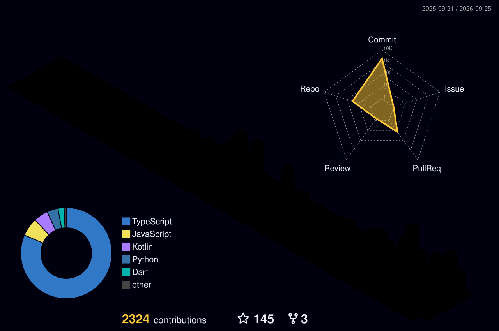

  <!-- The Aesthetic Looping GIF -->
  

 

  <!-- Ultra-Minimalist Floating Social Badges -->
  &nbsp;&nbsp;&nbsp;&nbsp;
  &nbsp;&nbsp;&nbsp;&nbsp;
  

  <!-- Fixed: Premium Modern Typing Animation -->
  

  

 

## 🧑‍💻 The Man Behind The Code
<table border="0" width="100%">
  <tr>
    <td width="60%">
      
I am a <b>B.Tech Computer Science student at DRIEMS University</b> and a <b>Full-stack Web & Mobile Developer</b>.

      
My passion lies in bridging the gap between futuristic concepts and real-world applications. I thrive on solving complex problems, building smart interactive tools, and engineering absolute chaos when developing prank apps!

       
      <ul>
        <li>🔥 <b>Current Focus:</b> Advanced Software Engineering, Computer Vision, & Mobile UI/UX.</li>
        <li>💡 <b>Interests:</b> Web Automation, AI Integration, and Native Android (Kotlin).</li>
        <li>⚡ <b>Fun Fact:</b> I built a tool that solves math via air-drawing gestures!</li>
        <li>👀 <b>Profile Views:</b> </li>
      </ul>
    </td>
    <td width="40%" align="center">
      
    </td>
  </tr>
</table>

 

  

  

  <i>"Engineering chaos and building the future, one stack at a time."</i>

 

<table align="center" border="0" width="100%" style="background-color: transparent;">
  <tr>
    <td align="center" width="33%" valign="top">
      <!-- Neon Green Header -->
      
        
      
    </td>
    <td align="center" width="33%" valign="top">
      <!-- Neon Cyan Header -->
      
        
      
    </td>
    <td align="center" width="33%" valign="top">
      <!-- Neon Pink Header -->
      
        
      
    </td>
  </tr>
</table>

  

  

  

 

  <a href="https://discord.com/users/1307714028717478008" target="_blank">
    <!-- bg=00000000 makes it perfectly transparent! -->
    
  </a>
  &nbsp;&nbsp;&nbsp;&nbsp;&nbsp;&nbsp;&nbsp;&nbsp;&nbsp;
  

 

  

  
 
### ⌨️ My Coding Stats

  
    
  
    
  

<!-- START_STATS -->
### 🐱 My GitHub Data
> 📦 1051.1 MB Used in GitHub's Storage
>  
> 🏆 1724 Contributions this Year
>  
> 🚫 Not Opted to Hire
>  
> 📜 33 Public Repositories
>  
> 🔑 10 Private Repositories
<!-- END_STATS -->

  

  <!-- Animated Neon Header -->
  

 

  <!-- Transparent Background Floating Stats -->
  
  &nbsp;&nbsp;&nbsp;&nbsp;&nbsp;
  

  <!-- Glowing Divider Line -->
  

 
 

### 🌆 3D Contribution City

  

### 📈 Contribution Activity Graph

  

  
    
  
  
<b>Created with 💖 by BASUDEV</b>

